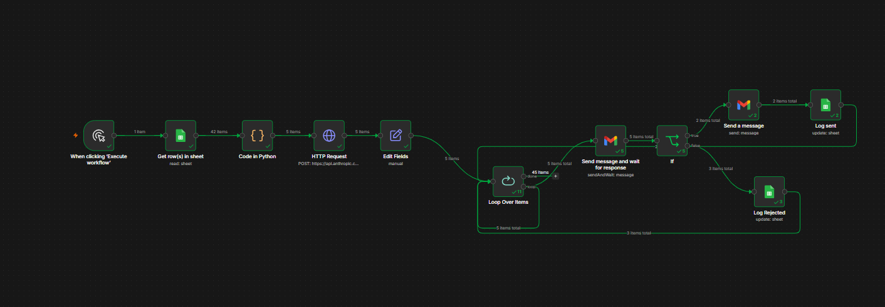

# Autonomous Customer Success Agent

An AI agent that watches a book of customer accounts, picks the ones at risk of churn, drafts re-engagement emails for them, and queues every message for human approval before anything sends.

Built two ways: first as a Python agent using the Anthropic Claude API with tool-calling, then rebuilt as an n8n workflow with email approval buttons and a Google Sheets back-end. Same logic, two implementations.

Runs on 8,469 real customer support tickets from Kaggle, aggregated into 42 product accounts.

Status: Stages 1 through 4 are complete. Stage 5 (dashboard) is next.



## What it does

The agent does seven things on each run:

1. Pulls the current state of every account from the book
2. Decides which accounts are highest priority based on MRR, satisfaction scores, support load, and how close their renewal is
3. Scores the priority accounts on a 1 to 5 churn risk scale
4. Drafts re-engagement emails for the high-risk ones
5. Queues every proposed email for human approval. It does not send anything directly
6. Logs what it did so the next run doesn't re-flag the same account
7. Prints a summary of the run with a watch list of accounts to keep an eye on

A full run takes about 30 seconds and costs around 20 cents in API usage.

## Why I built it

I worked in B2B account management at Goodyear for almost three years, handling 50+ commercial accounts. A lot of that job was constant triage: figuring out which accounts needed attention this week, drafting the right outreach, knowing when to escalate. This is the kind of work an agent can genuinely help with.

When I started learning AI development I wanted a project that showed both the agent engineering side and the customer success side. This is built with the actual stack a CS Ops team would use, on a real problem I understand from the inside.

## How it works

Python implementation (agent.py)

```
while not done:
  1. Send conversation history and tools to Claude
  2. If Claude requests a tool, run it
  3. Send the result back, loop
  4. Stop when Claude produces a final summary
```

tools.py: Five functions Claude can call, each with a JSON schema. Claude only sees the schemas, not the Python code.

data/account_book.csv: 42 product accounts. Real ticket signals plus a labeled synthetic financial overlay.

The five tools:

| Tool | What it does |
|------|--------------|
| get_accounts | Returns every account in the book |
| score_risk | Scores one account 1 to 5 with a reason |
| draft_outreach | Builds the context package for an email |
| flag_for_approval | Queues a proposed email for human review |
| log_action | Writes what the agent did into the account book |

n8n implementation (my_workflow.json)

The same logic rebuilt as a visual workflow that anyone on a CS Ops team could maintain without touching Python:

1. Trigger pulls 42 accounts from a Google Sheet
2. A Python code node filters to at-risk accounts using the same scoring logic as score_risk
3. An HTTP Request node calls Claude to draft each email
4. A Send message and wait node emails me an approval request with Approve and Reject buttons
5. A Loop Over Items wrapper handles each at-risk account one at a time
6. An IF node routes the response: approve sends the real customer outreach, reject just logs the decision
7. Both paths write back to the Google Sheet with status, last_action, and a timestamp

The screenshot above is from a real run: 42 accounts pulled, 5 flagged as at risk, all 5 routed through the human approval gate, 2 approved and 3 rejected. Every step is logged.

## The data

I used the Kaggle Customer Support Ticket Dataset, which has 8,469 anonymized support tickets across 42 products. I aggregated those tickets by product line so each product becomes an account in the book. Each account has:

- Real signals from the actual tickets: open_tickets, critical_tickets, critical_rate, avg_satisfaction, days_since_activity
- Synthetic financial fields suffixed with __SYNTH: plan_tier__SYNTH, mrr__SYNTH, renewal_date__SYNTH

The financial fields are made up because the Kaggle data doesn't have them, but I labeled them explicitly so anyone reading the data knows what's real and what isn't. That felt more honest than pretending they were real.

## Design decisions I made deliberately

Human in the loop. The agent never sends anything to customers directly. Every email goes into an approval queue first. A real CS Ops team would never deploy an autopilot, and I didn't want to build one.

Two implementations, same logic. The Python version shows I can build agents from primitives using the Anthropic API. The n8n version shows the same workflow assembled from off-the-shelf nodes. CS Ops teams usually want option two so non-engineers can maintain it. Building both made me think about which decisions belong in code versus configuration.

Selective scoring. The system prompt tells the agent to act like a senior CSM and only score the 3 to 5 highest priority accounts, not every one. This keeps the run fast and cheap, and it matches how a real account manager actually triages.

Real data, labeled honestly. Every signal the agent reasons over comes from a real support ticket. The synthetic financial fields are labeled so nobody mistakes them for real numbers.

Tool descriptions matter more than tool code. Claude only sees the JSON schemas, not the Python functions. The description fields are where I spent the most time, because that's what tells Claude when to use each tool. This is the actual engineering work of agent design.

## What an actual run looks like

A real trace from python agent.py is in run_log.txt. A few moments worth pointing out:

In turn 2, the agent picked five priority candidates by combining MRR, CSAT, renewal proximity, and ticket load. It didn't just filter on one column.

In turn 3, after the first batch only surfaced one risk-4 account, the agent broadened its search with different criteria and found another one. It corrected itself.

In turn 7, the agent produced a watch list of risk-3 accounts in its summary. The system prompt didn't ask for that. The agent did it because it made sense.

Here's one of the emails it drafted:

> Hi team,
>
> I noticed you have 139 open tickets with us right now, and your recent satisfaction scores have been running around 2.7. With your renewal coming up in just two weeks, I want to make sure we're giving you the support you need.
>
> I'd like to hop on a quick 15-minute call to hear what's been frustrating and see if we can turn things around before your renewal decision. We've helped similar accounts clear their backlogs and get back on track, and I think we can do the same for you.
>
> Would early next week work for a brief call? Just reply with a time that suits you.
>
> Matthew Ruryk

## How to run the Python version

You need Python 3.10 or higher and an API key from console.anthropic.com. $5 of credits is plenty.

```
git clone https://github.com/devmatty/n8n_agent_proj.git
cd n8n_agent_proj
pip install -r requirements.txt
cp .env.example .env
# then open .env and paste your real API key after ANTHROPIC_API_KEY=
python agent.py
```

You'll see a live trace as the agent reasons through 42 accounts and flags the high-risk ones. A full run costs roughly 20 cents.

## How to run the n8n version

The exported workflow is in my_workflow.json. To run it yourself:

1. Sign up for a free n8n Cloud account or install n8n locally
2. Create a new workflow and import my_workflow.json
3. Connect three credentials: Google Sheets, Gmail, and your Anthropic API key
4. Copy the account_book.csv data into a Google Sheet and update the Get rows node to point at it
5. Click Execute workflow

You'll receive an approval email for each at-risk account. Click Approve to send the real outreach, or Reject to log the decision and move on.

## Files

```
n8n_agent_proj/
  data/
    account_book.csv    42 accounts, real signals plus synthetic financials
  agent.py              The Python agent loop
  tools.py              The five tools and their JSON schemas
  run_log.txt           A real trace from a successful run
  requirements.txt      Python dependencies
  .env.example          Template for your API key
  my_workflow.json      The n8n workflow export
  workflow.png          Screenshot of the n8n workflow after a successful run
  README.md             This file
```

## What's next

- Stage 1, data: done
- Stage 2, tools: done
- Stage 3, agent loop: done
- Stage 4, n8n: done. Workflow handles 42 accounts, filters to at-risk, drafts emails, routes each through a human approval gate one at a time, logs the outcome
- Stage 5, dashboard: next. A simple page showing each run and what got flagged

## About me

I'm Matthew Ruryk. I spent almost three years in B2B account management at Goodyear, and I'm now looking for AI Operations and Customer Success roles at SaaS companies.

This is the third of three portfolio projects:

- Toronto 311 Triage Tool, built on 190,000 real civic service requests
- SaaS Account Health Dashboard for churn prediction and account health
- Autonomous CS Agent, this project

Reach me at matthewruryk@gmail.com.
